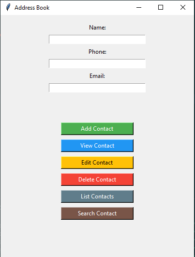
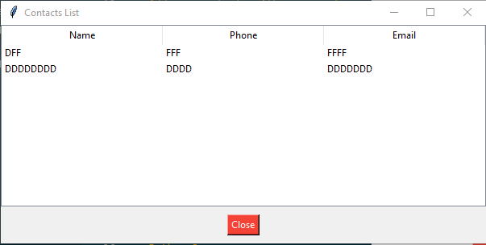

# Address Book App

## Table of Contents

- [Description](#description)
- [Features](#features)
- [Screenshots](#screenshots)
- [Getting Started](#getting-started)
- [Prerequisites](#prerequisites)
- [Installation](#installation)
- [Usage](#usage)
- [Contributing](#contributing)
- [License](#license)

## Description

The Address Book App is a simple desktop application built using Python and Tkinter. It allows users to manage their contacts by adding, viewing, editing, and deleting contact information. Contacts are stored in a CSV file, providing easy persistence between sessions.

## Features

- Add new contacts with names, phone numbers, and emails.
- View contact details.
- Edit existing contacts.
- Delete unwanted contacts.
- List all contacts in a separate window.
- Search for a specific contact by name.

## Screenshots




## Getting Started

### Prerequisites

- Python 3.x
- Tkinter (usually included with Python)

### Installation

1. Clone the repository:

    ```bash
    git clone https://github.com/GMPSANKALPA/address-book.git

2. Change into the project directory:

    ```bash
    cd address-book-app

3. Run the application:
    ```bash
    python main.py

## Usage
1. Launch the application by running main.py.
2. Use the provided buttons to add, view, edit, delete, list, or search for contacts.
3. The application will save contacts to a contacts.csv file for persistence.

## Contributing
Contributions are welcome! If you'd like to contribute, please follow these steps:

1. Fork the repository.
2. Create a new branch for your feature: git checkout -b feature-name.
3. Make your changes and commit them: git commit -m 'Add some feature'.
4. Push to the branch: git push origin feature-name.
5. Submit a pull request.

## License
This project is licensed under the [MIT](LICENSE) License.

----

<div align="center">

   
   
   
   

</div>